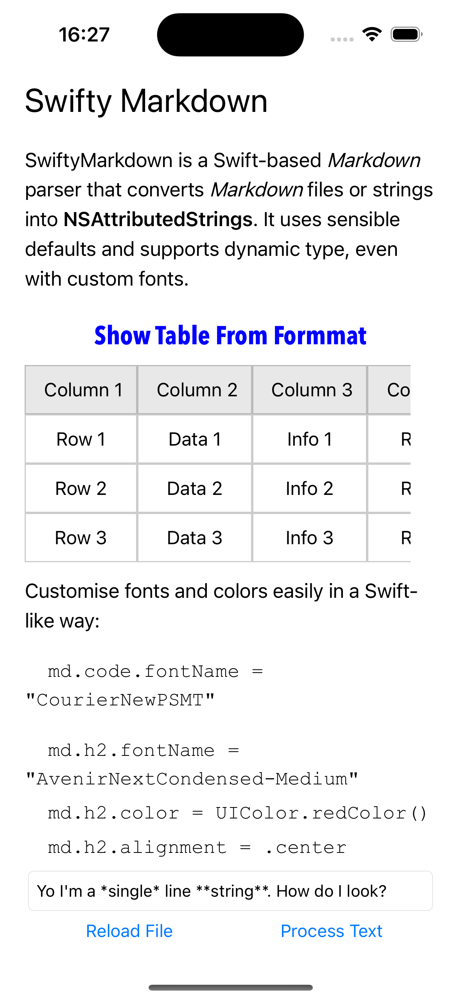
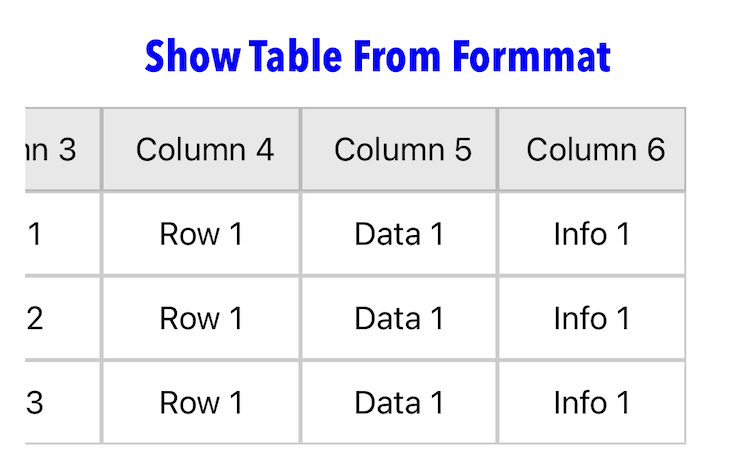

# SwiftyMarkdown_Extension
Base on [SwiftyMarkdown](https://github.com/SimonFairbairn/SwiftyMarkdown), but support table rendering and cloud image rendering~

Show Table Render And Support Scroll

Show Images From Your App Bundle And Clound
---

